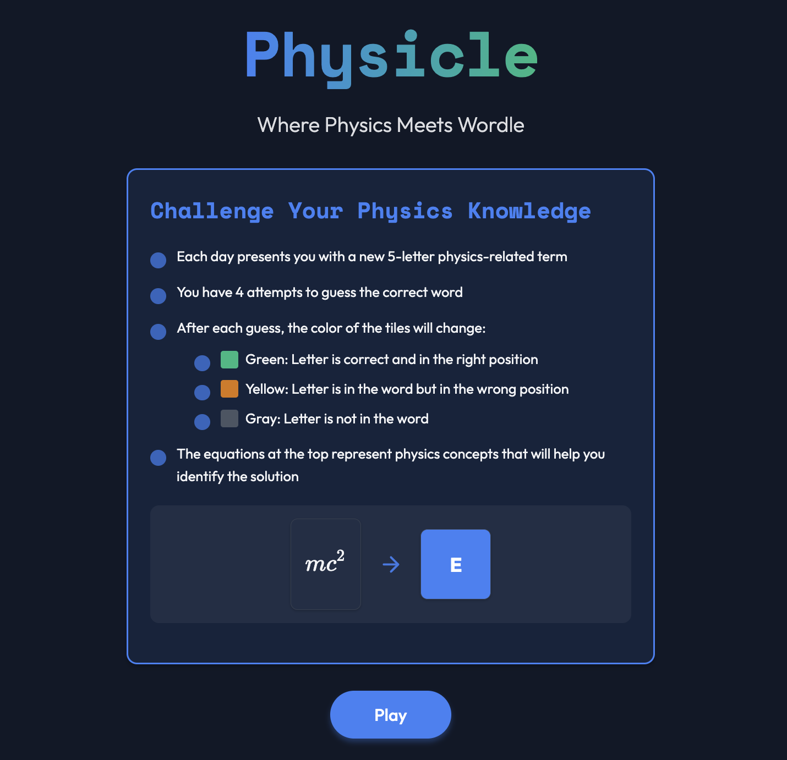

# Physicle

Physicle is a daily physics-themed word puzzle game inspired by Wordle. Players must decode physics equations to identify corresponding letters and spell out a 5-letter physics term.



## How to Play

1. Each day presents you with five physics equations
2. Each equation corresponds to a specific letter
3. Identify the physics concept represented by each equation
4. Enter the corresponding letters to spell out the target word
5. A new puzzle is released every day

## Features

- Clean, modern interface with dark theme
- Daily puzzles that update automatically
- Beautiful LaTeX rendering of physics equations
- Interactive keyboard and answer boxes
- Responsive design that works on desktop and mobile
- Timer to track how quickly you solve each puzzle

## Technology Stack

- HTML5
- CSS3
- JavaScript (ES6+)
- KaTeX for LaTeX rendering

## Installation

To run Physicle locally:

1. Clone this repository:
   ```
   git clone https://github.com/JamesticCS/physicle.git
   ```

2. Open `index.html` in a web browser

No build process or installation is required!

## Customizing Puzzles

You can add your own custom puzzles by editing the `dailyPuzzles` object in `script.js`:

```javascript
const dailyPuzzles = {
     Format: "YYYY-MM-DD": { word: "XXXXX", equations: [{ latex: "...", letter: "X", fullEquation: "...", explanation: "..." }, ...] }
    "2025-03-01": {
			word: "BRAVE",
			equations: [{
					latex: '\\frac{\\mu_0 I}{4\\pi} \\oint \\frac{d\\vec{l} \\times \\vec{r}}{r^2}',
					letter: "B",
					fullEquation: '\\vec{B} = \\frac{\\mu_0 I}{4\\pi} \\oint \\frac{d\\vec{l} \\times \\vec{r}}{r^2}',
					explanation: "Biot-Savart Law for magnetic field"
				},
				{
					latex: '\\frac{PV}{nT}',
					letter: "R",
					fullEquation: 'R = \\frac{PV}{nT}',
					explanation: "Ideal gas constant from PV = nRT"
				},
				{
					latex: '\\frac{\\Delta v}{\\Delta t}',
					letter: "A",
					fullEquation: 'a = \\frac{\\Delta v}{\\Delta t}',
					explanation: "Average acceleration"
				},
				{
					latex: '-\\int_{\\mathbf{r}_1}^{\\mathbf{r}_2} \\mathbf{E} \\cdot d\\mathbf{r}',
					letter: "V",
					fullEquation: '\\Delta V = -\\int_{\\mathbf{r}_1}^{\\mathbf{r}_2} \\mathbf{E} \\cdot d\\mathbf{r}',
					explanation: "Electric potential difference"
				},
				{
					latex: 'hf',
					letter: "E",
					fullEquation: 'E = hf',
					explanation: "Photon energy (Planck's equation)"
				}
			]
		}
		// Add or update other puzzles as needed
};
```

### LaTeX Examples for Equations

- Fractions: `\frac{a}{b}`
- Exponents: `a^2`
- Subscripts: `a_i`
- Greek letters: `\alpha`, `\beta`, `\gamma`, `\Delta`, `\lambda`
- Integrals: `\int_a^b f(x) \, dx`
- Square roots: `\sqrt{x}`
- Vectors: `\vec{F}`
- Partial derivatives: `\frac{\partial f}{\partial x}`
- Nabla operator: `\nabla`
- Infinity: `\infty`

For more LaTeX examples, visit: [KaTeX Supported Functions](https://katex.org/docs/supported.html)

## Contributing

Contributions are welcome! Feel free to submit a pull request or open an issue for:

- New physics puzzles
- Bug fixes
- UI improvements
- New features

## License

This project is licensed under the MIT License - see the LICENSE file for details.

## Acknowledgments

- Inspired by [Wordle](https://www.nytimes.com/games/wordle/index.html)
- Uses [KaTeX](https://katex.org/) for LaTeX rendering
- Developed by Jesse Hines
